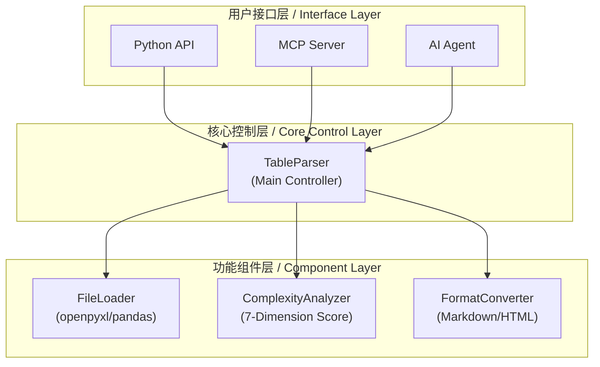
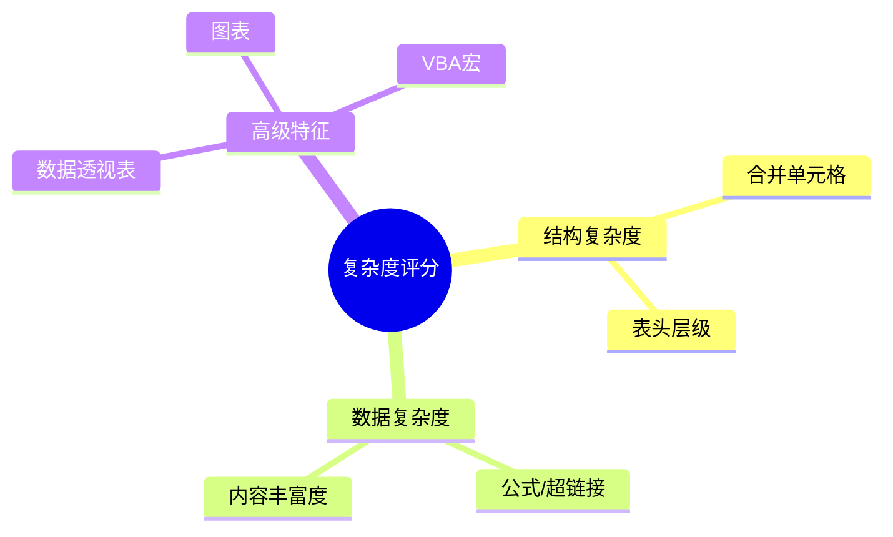
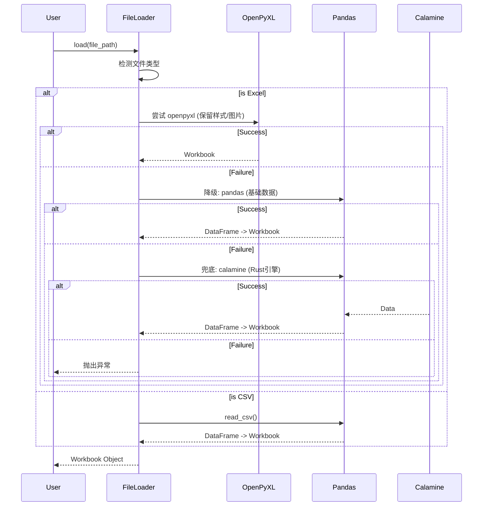
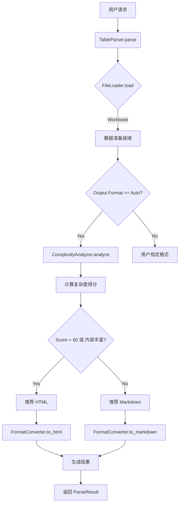

# 深度解析 TableParser：如何构建一个智能的 Excel/CSV 解析 Agent 工具

在 RAG 和 AI Agent 的应用场景中，结构化数据（尤其是 Excel 表格）的处理一直是一个痛点。简单的文本提取会丢失表格的二维结构，而直接转 HTML 又可能导致 token 消耗过大。

为了解决这个问题，我开发了 **TableParser** —— 一个轻量级、容错性强且具备"智能"的表格解析工具。本文将深入剖析其设计思路和核心技术实现。

> https://github.com/DemonDamon/TableParser

## 为什么需要 TableParser？

在构建企业级知识库时，我们发现现有的工具要么太重（依赖 Java/Office），要么太轻（只能读取纯文本）。我们需要一个中间态的方案：

1.  **保留结构**：合并单元格、多级表头不能丢。
2.  **节省 Token**：简单表格用 Markdown，复杂表格才用 HTML。
3.  **极高容错**：面对各种破损、加密、非标准格式的 Excel，不能轻易报错。

## 系统架构设计

TableParser 采用分层架构设计，核心理念是**模块解耦**与**流程编排**分离。


*(图1：TableParser 系统架构概览)*

系统主要分为三层：
- **用户接口层**：提供 Python API 和 MCP (Model Context Protocol) Server，方便 AI 智能体直接调用。
- **核心控制层**：`TableParser` 类作为指挥官，协调各个组件，并处理全局异常。
- **功能组件层**：包含文件加载、复杂度分析、格式转换等独立模块。

## 7维度动态复杂度评估

这是 TableParser 的"大脑"。为了决定表格是输出 Markdown 还是 HTML，我们不能只看行数。

我们设计了一个 **7维度评分系统**，根据表格特征动态调整权重。


*(图2：复杂度评估的7个维度)*

| 维度 | 简单表格示例 | 复杂表格示例 | 评估内容 |
| :--- | :--- | :--- | :--- |
| **合并单元格** | 无 (0分) | 大量跨行跨列 (80分) | 占比、复杂度 |
| **表头层级** | 单级 (0分) | 3级以上 (100分) | 跨行层级检测 |
| **公式/超链接** | 无 (0分) | 包含复杂公式 (30分) | 依赖关系分析 |
| **内容丰富度** | 纯文本 (0分) | 图片+样式 (100分) | 图片、颜色、富文本 |
| **数据透视表** | 无 (0分) | 3个以上 (70分) | 数量检测 |
| **图表** | 无 (0分) | 5个以上 (60分) | 可视化元素 |
| **VBA宏** | 无 (0分) | 存在 (100分) | 代码检测 |

### 动态权重算法

算法根据表格是否包含"高级特征"（如数据透视表、图表、VBA宏）来切换权重模式：

- **基础模式**：侧重于结构复杂度（合并单元格、表头层级）。
- **高级模式**：侧重于功能完整性（VBA、图表、数据透视表）。

代码实现逻辑（`analyzer.py` 核心片段）：

```python
def _calculate_total_score(self, scores):
    # 动态权重选择：检测高级特征是否存在
    has_advanced_features = (
        scores["pivot_tables"] > 0 or 
        scores["charts"] > 0 or 
        scores["vba_macros"] > 0
    )
    
    if has_advanced_features:
        weights = self.WEIGHTS_ADVANCED  # 均衡权重
    else:
        weights = self.WEIGHTS_BASE      # 结构主导权重
        
    # ... 加权计算 ...
```

## 三层容错加载机制

在实际业务中，Excel 文件的质量参差不齐。`loader.py` 实现了一个"三明治"式的加载策略，确保最大化成功率。


*(图3：三层容错加载时序图，源文件已保存至 images/loading_sequence.mmd)*

1.  **第一层 (OpenPyXL)**：功能最全，能提取图片、样式、颜色。
2.  **第二层 (Pandas)**：兼容性好，速度快，但会丢失样式。
3.  **第三层 (Calamine)**：基于 Rust 的高性能引擎，专门处理 Pandas 读不了的损坏文件。

## 完整处理流程

当用户发起一个解析请求时，数据是如何流转的？


*(图4：解析处理流程图，源文件已保存至 images/processing_flow.mmd)*

## 总结

TableParser 不仅仅是一个格式转换工具，它更像是一个通过"观察"（复杂度分析）来做出"决策"（格式选择）的智能 Agent 插件。