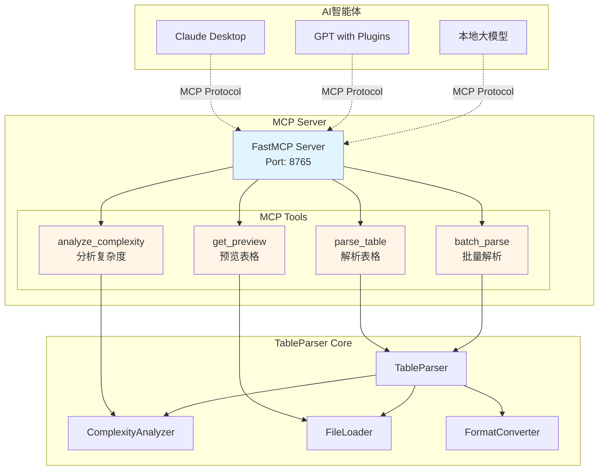
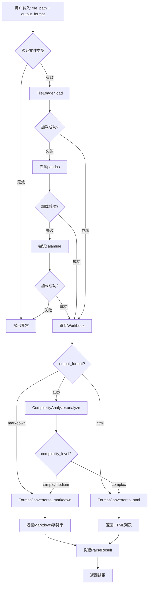
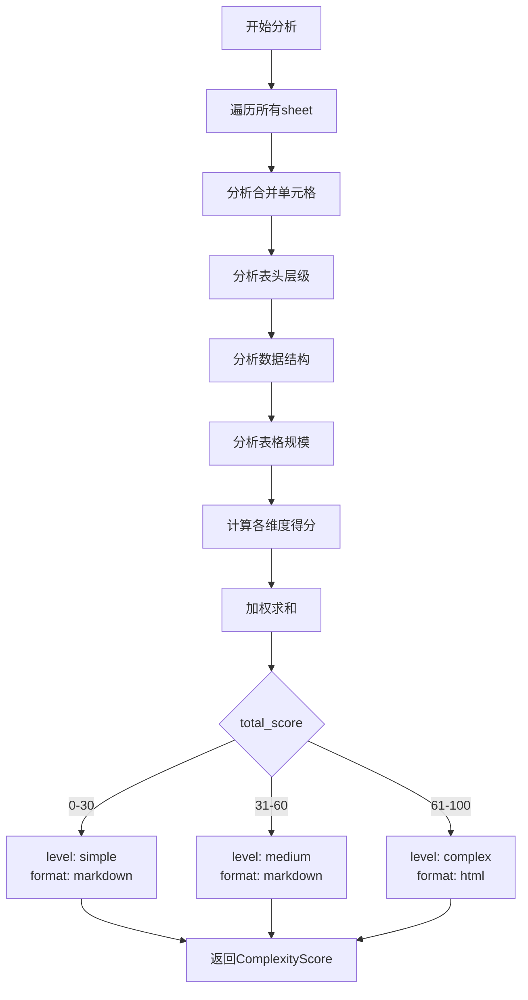

# TableParser 轻量级表格解析工具技术方案

## 一、项目概述

### 1.1 项目目标
构建一个轻量级的表格解析工具，支持Excel和CSV文件的智能解析，根据表格复杂度自动选择最佳输出格式（Markdown或HTML），同时支持用户自定义输出模式。

### 1.2 核心需求
- **输入格式**：Excel (.xlsx, .xls)、CSV (.csv)
- **输出格式**：Markdown（简单表格）、HTML（复杂表格）
- **智能选择**：自动判断表格复杂度并选择最佳输出格式
- **用户可控**：支持用户强制指定输出格式
- **轻量级**：最小化依赖，易于集成和部署
- **MCP工具化**：支持MCP协议，可被AI智能体直接调用

### 1.3 竞品分析总结

| 项目 | 核心技术栈 | 输出格式 | 优点 | 缺点 |
|------|-----------|---------|------|------|
| **RAGFlow** | openpyxl + pandas + calamine | HTML、Markdown、JSON | 三层容错机制，鲁棒性强 | 复杂度较高，依赖较多 |
| **Dify** | openpyxl + pandas | key:value文本 | 简洁清晰，支持超链接提取 | 输出格式单一，不适合复杂表格 |
| **MinerU** | MarkItDown | Markdown | 依赖Microsoft工具，功能全面 | Excel解析非核心功能，过度依赖第三方 |

## 二、系统设计

### 2.1 整体架构

```
┌─────────────────────────────────────────────────────────────┐
│                      AI智能体层                               │
│  ┌─────────────┐  ┌──────────────┐  ┌──────────────┐      │
│  │   Claude    │  │     GPT      │  │  本地模型     │      │
│  └─────────────┘  └──────────────┘  └──────────────┘      │
└─────────────────────────────────────────────────────────────┘
                            ↓  MCP Protocol
┌─────────────────────────────────────────────────────────────┐
│                      MCP服务层                                │
│  ┌──────────────────────────────────────────────────────┐  │
│  │         FastMCP Server (MCP工具服务器)                │  │
│  │  - parse_table         : 解析表格                     │  │
│  │  - analyze_complexity  : 分析复杂度                   │  │
│  │  - batch_parse         : 批量解析                     │  │
│  └──────────────────────────────────────────────────────┘  │
└─────────────────────────────────────────────────────────────┘
                            ↓
┌─────────────────────────────────────────────────────────────┐
│                        用户层                                 │
│  ┌─────────────┐  ┌──────────────┐  ┌──────────────┐      │
│  │  CLI 工具   │  │  Python API  │  │  REST API    │      │
│  └─────────────┘  └──────────────┘  └──────────────┘      │
└─────────────────────────────────────────────────────────────┘
                            ↓
┌─────────────────────────────────────────────────────────────┐
│                      核心解析层                               │
│  ┌──────────────────────────────────────────────────────┐  │
│  │            TableParser (主控制器)                     │  │
│  │  - parse()           : 主解析接口                     │  │
│  │  - detect_complexity(): 复杂度检测                    │  │
│  │  - auto_select_format(): 自动选择输出格式             │  │
│  └──────────────────────────────────────────────────────┘  │
│                            ↓                                 │
│  ┌──────────────────────────────────────────────────────┐  │
│  │           ComplexityAnalyzer (复杂度分析器)           │  │
│  │  - analyze_structure()  : 结构分析                    │  │
│  │  - calculate_score()    : 复杂度评分                 │  │
│  │  - get_complexity_level(): 复杂度等级                │  │
│  └──────────────────────────────────────────────────────┘  │
│                            ↓                                 │
│  ┌─────────────────┬──────────────────┬─────────────────┐  │
│  │  FileLoader     │  FormatConverter │  OutputRenderer │  │
│  │  (文件加载器)    │  (格式转换器)     │  (输出渲染器)    │  │
│  └─────────────────┴──────────────────┴─────────────────┘  │
└─────────────────────────────────────────────────────────────┘
                            ↓
┌─────────────────────────────────────────────────────────────┐
│                      基础工具层                               │
│  ┌──────────────┐  ┌──────────────┐  ┌──────────────┐    │
│  │  openpyxl    │  │  pandas      │  │  标准库       │    │
│  │  (主解析)     │  │  (备用解析)   │  │  (csv等)      │    │
│  └──────────────┘  └──────────────┘  └──────────────┘    │
└─────────────────────────────────────────────────────────────┘
```

### 2.2 核心组件设计

#### 2.2.1 TableParser (主控制器)
```python
class TableParser:
    """
    表格解析主控制器
    
    职责：
    1. 统一解析接口
    2. 协调各组件工作
    3. 处理异常和容错
    """
    
    def parse(
        self,
        file_path: str | bytes,
        output_format: Optional[Literal["auto", "markdown", "html"]] = "auto",
        **options
    ) -> ParseResult:
        """
        主解析方法
        
        Args:
            file_path: 文件路径或二进制内容
            output_format: 输出格式 (auto/markdown/html)
            **options: 其他选项
                - chunk_rows: HTML分块行数 (默认256)
                - encoding: CSV编码 (默认auto)
                - clean_illegal_chars: 清理非法字符 (默认True)
                
        Returns:
            ParseResult: 解析结果对象
        """
```

#### 2.2.2 ComplexityAnalyzer (复杂度分析器)
```python
class ComplexityAnalyzer:
    """
    表格复杂度分析器
    
    评估维度：
    1. 合并单元格数量和比例
    2. 多级表头深度
    3. 嵌套表格结构
    4. 行列数规模
    5. 数据类型多样性
    """
    
    def analyze(self, workbook) -> ComplexityScore:
        """
        分析表格复杂度
        
        Returns:
            ComplexityScore: 包含各维度评分的对象
        """
```

#### 2.2.3 FileLoader (文件加载器)
```python
class FileLoader:
    """
    文件加载器 - 多引擎容错机制
    
    加载策略：
    1. 优先使用openpyxl (支持完整的Excel特性)
    2. 失败时降级到pandas (兼容性更好)
    3. pandas失败时尝试calamine引擎
    4. 自动识别CSV并转换为Workbook
    """
    
    def load(self, file_like: str | bytes) -> Workbook:
        """加载文件并返回openpyxl Workbook对象"""
```

#### 2.2.4 FormatConverter (格式转换器)
```python
class FormatConverter:
    """
    格式转换器
    
    支持转换：
    - Workbook -> Markdown
    - Workbook -> HTML
    - DataFrame -> Workbook (用于CSV)
    """
    
    def to_markdown(self, workbook, **options) -> str:
        """转换为Markdown格式"""
    
    def to_html(self, workbook, **options) -> list[str]:
        """转换为HTML格式（支持分块）"""
```

## 三、MCP工具化设计

### 3.1 MCP协议简介

**MCP (Model Context Protocol)** 是Anthropic推出的开放标准协议，用于连接AI模型与外部工具、数据源。通过MCP，AI智能体可以：
- 调用外部工具函数
- 访问上下文数据
- 执行复杂任务

**FastMCP** 是一个轻量级Python框架，简化MCP服务器的开发，支持：
- 快速定义MCP工具
- 自动参数验证
- 内置类型提示
- 简单的部署方式

### 3.2 MCP服务架构



### 3.3 MCP工具定义

#### 3.3.1 parse_table - 解析表格工具

```python
from fastmcp import FastMCP
from table_parser import TableParser
import base64

mcp = FastMCP("TableParser MCP Server")
parser = TableParser()

@mcp.tool()
def parse_table(
    file_path: str = None,
    file_content_base64: str = None,
    output_format: str = "auto",
    chunk_rows: int = 256,
    clean_illegal_chars: bool = True
) -> dict:
    """
    解析Excel或CSV表格文件
    
    Args:
        file_path: 文件路径（优先使用）
        file_content_base64: Base64编码的文件内容（file_path不存在时使用）
        output_format: 输出格式 (auto/markdown/html)
        chunk_rows: HTML分块行数
        clean_illegal_chars: 是否清理非法字符
        
    Returns:
        {
            "success": bool,
            "output_format": str,  # 实际使用的格式
            "content": str | list[str],
            "complexity_score": {
                "total_score": float,
                "level": str,
                "recommended_format": str
            },
            "metadata": {
                "sheets": int,
                "total_rows": int,
                "total_cols": int
            }
        }
    
    Examples:
        # 解析本地文件
        result = parse_table(file_path="/path/to/data.xlsx")
        
        # 解析Base64内容
        with open("data.xlsx", "rb") as f:
            content_b64 = base64.b64encode(f.read()).decode()
        result = parse_table(file_content_base64=content_b64)
        
        # 强制HTML输出
        result = parse_table(
            file_path="/path/to/data.xlsx",
            output_format="html"
        )
    """
    try:
        # 确定输入源
        if file_path:
            input_data = file_path
        elif file_content_base64:
            input_data = base64.b64decode(file_content_base64)
        else:
            return {
                "success": False,
                "error": "必须提供 file_path 或 file_content_base64"
            }
        
        # 执行解析
        result = parser.parse(
            input_data,
            output_format=output_format,
            chunk_rows=chunk_rows,
            clean_illegal_chars=clean_illegal_chars
        )
        
        return result.to_dict()
        
    except Exception as e:
        return {
            "success": False,
            "error": str(e)
        }
```

#### 3.3.2 analyze_complexity - 分析复杂度工具

```python
@mcp.tool()
def analyze_complexity(
    file_path: str = None,
    file_content_base64: str = None
) -> dict:
    """
    分析表格复杂度（不生成输出内容，仅评估）
    
    Args:
        file_path: 文件路径
        file_content_base64: Base64编码的文件内容
        
    Returns:
        {
            "success": bool,
            "complexity_score": {
                "total_score": float,
                "level": str,  # simple/medium/complex
                "recommended_format": str,
                "dimensions": {
                    "merged_cells_score": float,
                    "header_depth_score": float,
                    "data_structure_score": float,
                    "scale_score": float
                }
            },
            "metadata": {
                "sheets": int,
                "total_rows": int,
                "total_cols": int,
                "merged_cells_count": int,
                "has_formulas": bool,
                "has_hyperlinks": bool
            },
            "recommendation": str  # 人类可读的建议
        }
    
    Examples:
        # 在解析前先分析
        analysis = analyze_complexity(file_path="/path/to/data.xlsx")
        if analysis["complexity_score"]["level"] == "complex":
            print("检测到复杂表格，推荐使用HTML格式")
    """
    try:
        # 确定输入源
        if file_path:
            input_data = file_path
        elif file_content_base64:
            input_data = base64.b64decode(file_content_base64)
        else:
            return {
                "success": False,
                "error": "必须提供 file_path 或 file_content_base64"
            }
        
        # 加载文件
        loader = parser.loader
        workbook = loader.load(input_data)
        
        # 分析复杂度
        analyzer = parser.analyzer
        score = analyzer.analyze(workbook)
        
        # 生成人类可读建议
        recommendation = _generate_recommendation(score)
        
        return {
            "success": True,
            "complexity_score": {
                "total_score": score.total_score,
                "level": score.level,
                "recommended_format": score.recommended_format,
                "dimensions": {
                    "merged_cells_score": score.merged_cells_score,
                    "header_depth_score": score.header_depth_score,
                    "data_structure_score": score.data_structure_score,
                    "scale_score": score.scale_score
                }
            },
            "metadata": score.details,
            "recommendation": recommendation
        }
        
    except Exception as e:
        return {
            "success": False,
            "error": str(e)
        }

def _generate_recommendation(score: ComplexityScore) -> str:
    """生成人类可读的建议"""
    if score.level == "simple":
        return f"这是一个简单表格（得分{score.total_score:.1f}），推荐使用Markdown格式，易于阅读和编辑。"
    elif score.level == "medium":
        return f"这是一个中等复杂度表格（得分{score.total_score:.1f}），可以使用Markdown，但部分结构可能无法完美保留。如需精确还原，请使用HTML格式。"
    else:
        return f"这是一个复杂表格（得分{score.total_score:.1f}），包含合并单元格或多级表头，强烈推荐使用HTML格式以保留完整结构。"
```

#### 3.3.3 batch_parse - 批量解析工具

```python
@mcp.tool()
def batch_parse(
    file_paths: list[str],
    output_format: str = "auto",
    output_dir: str = "./output",
    max_workers: int = 4
) -> dict:
    """
    批量解析多个表格文件
    
    Args:
        file_paths: 文件路径列表
        output_format: 输出格式 (auto/markdown/html)
        output_dir: 输出目录
        max_workers: 最大并发数
        
    Returns:
        {
            "success": bool,
            "total": int,
            "succeeded": int,
            "failed": int,
            "results": [
                {
                    "file": str,
                    "status": str,  # success/failed
                    "output_file": str,
                    "complexity_level": str
                }
            ]
        }
    
    Examples:
        result = batch_parse(
            file_paths=[
                "/data/report1.xlsx",
                "/data/report2.csv",
                "/data/table3.xlsx"
            ],
            output_format="auto",
            output_dir="./parsed_tables"
        )
    """
    from pathlib import Path
    from concurrent.futures import ThreadPoolExecutor, as_completed
    
    Path(output_dir).mkdir(parents=True, exist_ok=True)
    
    results = []
    succeeded = 0
    failed = 0
    
    def process_file(file_path):
        try:
            result = parser.parse(file_path, output_format=output_format)
            
            # 保存输出
            file_stem = Path(file_path).stem
            if result.output_format == "markdown":
                output_file = Path(output_dir) / f"{file_stem}.md"
                output_file.write_text(result.content)
            else:  # HTML
                output_file = Path(output_dir) / f"{file_stem}.html"
                output_file.write_text("\n\n".join(result.content))
            
            return {
                "file": file_path,
                "status": "success",
                "output_file": str(output_file),
                "complexity_level": result.complexity_score.level
            }
            
        except Exception as e:
            return {
                "file": file_path,
                "status": "failed",
                "error": str(e)
            }
    
    # 并行处理
    with ThreadPoolExecutor(max_workers=max_workers) as executor:
        futures = {executor.submit(process_file, fp): fp for fp in file_paths}
        
        for future in as_completed(futures):
            result = future.result()
            results.append(result)
            
            if result["status"] == "success":
                succeeded += 1
            else:
                failed += 1
    
    return {
        "success": True,
        "total": len(file_paths),
        "succeeded": succeeded,
        "failed": failed,
        "results": results
    }
```

#### 3.3.4 get_preview - 预览表格工具

```python
@mcp.tool()
def get_preview(
    file_path: str = None,
    file_content_base64: str = None,
    max_rows: int = 10,
    max_cols: int = 10
) -> dict:
    """
    预览表格内容（不完整解析，快速返回）
    
    Args:
        file_path: 文件路径
        file_content_base64: Base64编码的文件内容
        max_rows: 最大预览行数
        max_cols: 最大预览列数
        
    Returns:
        {
            "success": bool,
            "sheets": [
                {
                    "name": str,
                    "preview": [[cell_values]],  # 二维数组
                    "total_rows": int,
                    "total_cols": int
                }
            ],
            "metadata": {
                "file_size": int,
                "sheets_count": int
            }
        }
    
    Examples:
        # 快速预览文件内容
        preview = get_preview(
            file_path="/path/to/data.xlsx",
            max_rows=5
        )
        print(f"文件包含 {preview['metadata']['sheets_count']} 个sheet")
        for sheet in preview['sheets']:
            print(f"Sheet: {sheet['name']}, 行数: {sheet['total_rows']}")
    """
    try:
        # 确定输入源
        if file_path:
            input_data = file_path
        elif file_content_base64:
            input_data = base64.b64decode(file_content_base64)
        else:
            return {
                "success": False,
                "error": "必须提供 file_path 或 file_content_base64"
            }
        
        # 加载文件
        loader = parser.loader
        workbook = loader.load(input_data)
        
        sheets = []
        for sheet_name in workbook.sheetnames:
            sheet = workbook[sheet_name]
            
            # 提取预览数据
            preview_data = []
            for i, row in enumerate(sheet.iter_rows(values_only=True)):
                if i >= max_rows:
                    break
                preview_data.append(list(row[:max_cols]))
            
            sheets.append({
                "name": sheet_name,
                "preview": preview_data,
                "total_rows": sheet.max_row,
                "total_cols": sheet.max_column
            })
        
        return {
            "success": True,
            "sheets": sheets,
            "metadata": {
                "sheets_count": len(workbook.sheetnames)
            }
        }
        
    except Exception as e:
        return {
            "success": False,
            "error": str(e)
        }
```

### 3.4 MCP服务器配置

#### 3.4.1 服务器启动脚本

```python
# mcp_server.py
from fastmcp import FastMCP
from table_parser import TableParser
import base64
from pathlib import Path

# 创建MCP服务器
mcp = FastMCP(
    name="TableParser",
    version="1.0.0",
    description="智能表格解析工具 - 支持Excel和CSV，自动选择最佳输出格式"
)

# 初始化解析器
parser = TableParser()

# 注册工具（上面定义的4个工具）
# ... (工具定义代码)

if __name__ == "__main__":
    # 启动服务器
    mcp.run(
        transport="stdio",  # 使用标准输入输出（推荐）
        # 或者使用HTTP
        # transport="http",
        # host="0.0.0.0",
        # port=8765
    )
```

#### 3.4.2 Claude Desktop配置

在 `~/Library/Application Support/Claude/claude_desktop_config.json` 中添加：

```json
{
  "mcpServers": {
    "table-parser": {
      "command": "python",
      "args": [
        "-u",
        "/path/to/table_parser/mcp_server.py"
      ],
      "env": {
        "PYTHONPATH": "/path/to/table_parser"
      }
    }
  }
}
```

#### 3.4.3 Docker部署配置

```dockerfile
# Dockerfile
FROM python:3.11-slim

WORKDIR /app

# 安装依赖
COPY requirements.txt .
RUN pip install --no-cache-dir -r requirements.txt

# 复制代码
COPY table_parser/ ./table_parser/
COPY mcp_server.py .

# 暴露端口（HTTP模式）
EXPOSE 8765

# 启动MCP服务器
CMD ["python", "mcp_server.py"]
```

```yaml
# docker-compose.yml
version: '3.8'

services:
  table-parser-mcp:
    build: .
    container_name: table-parser-mcp
    ports:
      - "8765:8765"
    volumes:
      - ./data:/app/data  # 挂载数据目录
      - ./output:/app/output  # 挂载输出目录
    environment:
      - PYTHONUNBUFFERED=1
    restart: unless-stopped
```

### 3.5 使用场景示例

#### 场景1: AI智能体自动分析报表

```
用户: "帮我分析这个销售报表 /data/sales_2024.xlsx，并告诉我应该用什么格式导出"

Claude (调用MCP工具):
1. analyze_complexity(file_path="/data/sales_2024.xlsx")
   → 得到复杂度评分: 45分，medium级别
   
2. parse_table(
     file_path="/data/sales_2024.xlsx",
     output_format="markdown"
   )
   → 生成Markdown内容

Claude: "我已经分析了这个报表：
- 复杂度评分: 45分（中等）
- 表格规模: 150行 × 8列
- 包含少量合并单元格
- 推荐格式: Markdown（简洁易读）

以下是解析后的内容：
[Markdown表格内容]

如果您需要保留完整的合并单元格结构，我可以为您生成HTML版本。"
```

#### 场景2: 批量处理多个文件

```
用户: "把 /reports 目录下所有xlsx文件转换为markdown"

Claude (调用MCP工具):
batch_parse(
    file_paths=["/reports/file1.xlsx", "/reports/file2.xlsx", ...],
    output_format="auto",
    output_dir="/reports/parsed"
)

Claude: "批量处理完成：
- 总计: 25个文件
- 成功: 23个
- 失败: 2个（文件损坏）

处理统计:
- 简单表格(Markdown): 18个
- 复杂表格(HTML): 5个

所有文件已保存到 /reports/parsed 目录。"
```

#### 场景3: 快速预览大文件

```
用户: "这个Excel文件太大了，先预览一下内容"

Claude (调用MCP工具):
get_preview(
    file_path="/data/large_dataset.xlsx",
    max_rows=5
)

Claude: "文件预览：
Sheet 1: 员工信息（共2500行 × 15列）
前5行数据：
| 员工编号 | 姓名 | 部门 | ...
|---------|------|------|
| E001    | 张三 | 销售 | ...
| E002    | 李四 | 技术 | ...
...

这是一个大型数据集，完整解析可能需要10-20秒。是否继续？"
```

### 3.6 MCP工具的优势

| 对比维度 | 传统API调用 | MCP工具调用 |
|---------|-----------|-----------|
| **集成复杂度** | 需要编写调用代码 | AI自动调用，零代码 |
| **参数理解** | 需要查文档 | AI理解自然语言意图 |
| **错误处理** | 手动处理异常 | AI智能重试和建议 |
| **上下文感知** | 无上下文 | AI理解对话历史 |
| **用户体验** | 技术门槛高 | 自然语言交互 |
| **灵活性** | 固定流程 | AI动态决策 |

### 3.7 安全性考虑

#### 文件访问控制
```python
# 限制文件访问路径
ALLOWED_PATHS = [
    "/data",
    "/reports",
    "/tmp/uploads"
]

def validate_file_path(file_path: str) -> bool:
    """验证文件路径是否在允许的目录中"""
    abs_path = Path(file_path).resolve()
    return any(
        abs_path.is_relative_to(Path(allowed).resolve())
        for allowed in ALLOWED_PATHS
    )

@mcp.tool()
def parse_table(file_path: str = None, ...):
    if file_path and not validate_file_path(file_path):
        return {
            "success": False,
            "error": "文件路径不在允许的目录中"
        }
    # ... 继续处理
```

#### 文件大小限制
```python
MAX_FILE_SIZE = 50 * 1024 * 1024  # 50MB

def validate_file_size(file_path: str) -> bool:
    """验证文件大小"""
    return Path(file_path).stat().st_size <= MAX_FILE_SIZE
```

#### 速率限制
```python
from functools import lru_cache
import time

@lru_cache(maxsize=100)
def rate_limit_check(client_id: str) -> bool:
    """简单的速率限制"""
    # 实际应用中使用Redis等实现
    pass
```

## 四、表格复杂度评估算法

### 4.1 复杂度评估维度

```python
@dataclass
class ComplexityScore:
    """复杂度评分结构"""
    # 各维度评分 (0-100)
    merged_cells_score: float      # 合并单元格复杂度
    header_depth_score: float      # 表头层级复杂度
    data_structure_score: float    # 数据结构复杂度
    scale_score: float             # 规模复杂度
    
    # 综合得分
    total_score: float
    
    # 复杂度等级
    level: Literal["simple", "medium", "complex"]
    
    # 推荐输出格式
    recommended_format: Literal["markdown", "html"]
```

### 4.2 评分规则

#### 维度1: 合并单元格复杂度 (权重: 40%)
```python
def calculate_merged_cells_score(self, sheet) -> float:
    """
    评估合并单元格复杂度
    
    规则：
    - 无合并单元格: 0分
    - 合并比例 < 5%: 20分
    - 合并比例 5-15%: 50分
    - 合并比例 > 15%: 80分
    - 存在跨行跨列复杂合并: +20分
    """
    merged_ranges = sheet.merged_cells.ranges
    total_cells = sheet.max_row * sheet.max_column
    
    if not merged_ranges:
        return 0
    
    # 计算合并单元格占比
    merged_count = sum(
        (r.max_row - r.min_row + 1) * (r.max_col - r.min_col + 1)
        for r in merged_ranges
    )
    merge_ratio = merged_count / total_cells if total_cells > 0 else 0
    
    # 检测复杂合并 (既跨行又跨列)
    has_complex_merge = any(
        (r.max_row - r.min_row > 0) and (r.max_col - r.min_col > 0)
        for r in merged_ranges
    )
    
    score = 0
    if merge_ratio < 0.05:
        score = 20
    elif merge_ratio < 0.15:
        score = 50
    else:
        score = 80
    
    if has_complex_merge:
        score = min(100, score + 20)
    
    return score
```

#### 维度2: 表头层级复杂度 (权重: 30%)
```python
def calculate_header_depth_score(self, sheet) -> float:
    """
    评估表头层级复杂度
    
    规则：
    - 单行表头: 0分
    - 2级表头: 30分
    - 3级表头: 60分
    - 4级及以上: 100分
    
    检测方法：
    - 分析前N行的合并单元格模式
    - 识别层级结构（父-子关系）
    """
    # 分析前5行的合并模式
    header_rows = min(5, sheet.max_row)
    merged_in_header = [
        r for r in sheet.merged_cells.ranges
        if r.min_row <= header_rows
    ]
    
    if not merged_in_header:
        return 0  # 无合并，可能是单级表头
    
    # 检测跨行合并（多级表头特征）
    max_row_span = max(
        (r.max_row - r.min_row + 1) for r in merged_in_header
    )
    
    if max_row_span == 1:
        return 0  # 只有横向合并，单级表头
    elif max_row_span == 2:
        return 30
    elif max_row_span == 3:
        return 60
    else:
        return 100
```

#### 维度3: 数据结构复杂度 (权重: 20%)
```python
def calculate_data_structure_score(self, sheet) -> float:
    """
    评估数据结构复杂度
    
    规则：
    - 纯文本数据: 0分
    - 包含数字/日期: 10分
    - 包含公式: 30分
    - 包含超链接: 20分
    - 包含富文本/样式: 30分
    """
    score = 0
    
    # 采样检查（避免遍历大表）
    sample_size = min(100, sheet.max_row * sheet.max_column)
    
    has_formula = False
    has_hyperlink = False
    has_rich_text = False
    
    for row in sheet.iter_rows(max_row=min(20, sheet.max_row)):
        for cell in row:
            # 检测公式
            if cell.data_type == 'f':
                has_formula = True
            # 检测超链接
            if cell.hyperlink:
                has_hyperlink = True
            # 检测富文本（简化检测）
            if hasattr(cell, 'font') and cell.font and cell.font.bold:
                has_rich_text = True
    
    if has_formula:
        score += 30
    if has_hyperlink:
        score += 20
    if has_rich_text:
        score += 30
    
    return min(100, score)
```

#### 维度4: 规模复杂度 (权重: 10%)
```python
def calculate_scale_score(self, sheet) -> float:
    """
    评估表格规模复杂度
    
    规则：
    - 小表 (<100单元格): 0分
    - 中表 (100-1000): 20分
    - 大表 (1000-10000): 50分
    - 超大表 (>10000): 80分
    """
    total_cells = sheet.max_row * sheet.max_column
    
    if total_cells < 100:
        return 0
    elif total_cells < 1000:
        return 20
    elif total_cells < 10000:
        return 50
    else:
        return 80
```

### 4.3 综合评分与等级判定

```python
def calculate_total_score(self, scores: dict) -> tuple[float, str, str]:
    """
    计算综合得分并确定复杂度等级
    
    权重配置：
    - 合并单元格: 40%
    - 表头层级: 30%
    - 数据结构: 20%
    - 表格规模: 10%
    
    等级划分：
    - simple (简单): 0-30分 -> 推荐Markdown
    - medium (中等): 31-60分 -> 推荐Markdown，但提示可能有损失
    - complex (复杂): 61-100分 -> 强制HTML
    """
    weights = {
        'merged_cells': 0.40,
        'header_depth': 0.30,
        'data_structure': 0.20,
        'scale': 0.10
    }
    
    total = sum(
        scores[key] * weights[key]
        for key in weights.keys()
    )
    
    # 确定等级和推荐格式
    if total <= 30:
        level = "simple"
        recommended = "markdown"
    elif total <= 60:
        level = "medium"
        recommended = "markdown"  # 可选HTML
    else:
        level = "complex"
        recommended = "html"
    
    return total, level, recommended
```

## 五、输出格式实现

### 5.1 Markdown 输出

**优点**：
- 简洁易读
- 适合文档嵌入
- 版本控制友好

**局限性**：
- 不支持合并单元格
- 不支持多级表头
- 不支持嵌套结构

**实现方案**：使用pandas的`to_markdown()`方法

```python
def to_markdown(self, workbook: Workbook, **options) -> str:
    """
    转换为Markdown格式
    
    策略：
    - 每个sheet转换为独立表格
    - 使用pandas的to_markdown()
    - 合并单元格会被展开（取第一个值）
    - 添加sheet名称作为标题
    """
    results = []
    
    for sheet_name in workbook.sheetnames:
        sheet = workbook[sheet_name]
        
        # 转换为DataFrame
        data = []
        for row in sheet.iter_rows(values_only=True):
            data.append(row)
        
        if not data:
            continue
        
        df = pd.DataFrame(data[1:], columns=data[0])
        
        # 添加sheet标题
        if sheet_name.lower() not in ['sheet', 'sheet1']:
            results.append(f"## {sheet_name}\n")
        
        # 转换为markdown
        md_table = df.to_markdown(index=False)
        results.append(md_table)
        results.append("\n")
    
    return "\n".join(results)
```

### 5.2 HTML 输出

**优点**：
- 完整保留表格结构
- 支持合并单元格（rowspan/colspan）
- 支持多级表头
- 支持样式保留（可选）

**实现方案**：参考RAGFlow的实现，支持分块

```python
def to_html(
    self, 
    workbook: Workbook, 
    chunk_rows: int = 256,
    preserve_styles: bool = False,
    **options
) -> list[str]:
    """
    转换为HTML格式
    
    参数：
    - chunk_rows: 每个HTML表格的最大行数（分块处理大表）
    - preserve_styles: 是否保留样式（字体、颜色等）
    
    返回：
    - HTML字符串列表（每个元素是一个表格）
    """
    from html import escape
    
    html_chunks = []
    
    for sheet_name in workbook.sheetnames:
        sheet = workbook[sheet_name]
        rows = list(sheet.rows)
        
        if not rows:
            continue
        
        # 处理表头
        header_html = "<tr>"
        for cell in rows[0]:
            header_html += f"<th>{escape(self._format_cell(cell))}</th>"
        header_html += "</tr>"
        
        # 分块处理数据行
        for chunk_idx in range((len(rows) - 1) // chunk_rows + 1):
            start_row = 1 + chunk_idx * chunk_rows
            end_row = min(1 + (chunk_idx + 1) * chunk_rows, len(rows))
            
            html = f'<table>\n<caption>{escape(sheet_name)}</caption>\n'
            html += header_html + "\n"
            
            # 处理数据行
            for row in rows[start_row:end_row]:
                html += "<tr>"
                for cell in row:
                    # 处理合并单元格
                    attrs = self._get_cell_attributes(cell, sheet)
                    html += f"<td{attrs}>"
                    html += escape(self._format_cell(cell))
                    html += "</td>"
                html += "</tr>\n"
            
            html += "</table>\n"
            html_chunks.append(html)
    
    return html_chunks

def _get_cell_attributes(self, cell, sheet) -> str:
    """
    获取单元格属性（rowspan/colspan）
    """
    attrs = ""
    
    # 检查是否在合并单元格中
    for merged_range in sheet.merged_cells.ranges:
        if cell.coordinate in merged_range:
            # 只为合并区域的左上角单元格添加属性
            if cell.coordinate == merged_range.min_coord:
                row_span = merged_range.max_row - merged_range.min_row + 1
                col_span = merged_range.max_col - merged_range.min_col + 1
                
                if row_span > 1:
                    attrs += f' rowspan="{row_span}"'
                if col_span > 1:
                    attrs += f' colspan="{col_span}"'
            break
    
    return attrs
```

## 六、核心流程

### 6.1 完整解析流程



### 6.2 复杂度分析流程



## 七、数据结构定义

### 7.1 核心类型

```python
from typing import Literal, Optional, Union
from dataclasses import dataclass
from pathlib import Path

# 输出格式类型
OutputFormat = Literal["auto", "markdown", "html"]

# 复杂度等级
ComplexityLevel = Literal["simple", "medium", "complex"]

@dataclass
class ParseOptions:
    """解析选项配置"""
    output_format: OutputFormat = "auto"
    chunk_rows: int = 256  # HTML分块大小
    encoding: Optional[str] = None  # CSV编码
    clean_illegal_chars: bool = True  # 清理非法字符
    preserve_styles: bool = False  # 保留样式（HTML）
    include_empty_rows: bool = False  # 包含空行

@dataclass
class ComplexityScore:
    """复杂度评分"""
    merged_cells_score: float
    header_depth_score: float
    data_structure_score: float
    scale_score: float
    total_score: float
    level: ComplexityLevel
    recommended_format: OutputFormat
    
    # 详细信息
    details: dict[str, any]

@dataclass
class ParseResult:
    """解析结果"""
    success: bool
    output_format: str  # 实际使用的格式
    content: Union[str, list[str]]  # Markdown为str, HTML为list
    complexity_score: Optional[ComplexityScore]
    metadata: dict[str, any]
    error: Optional[str] = None
    
    def to_dict(self) -> dict:
        """转换为字典"""
        return {
            "success": self.success,
            "output_format": self.output_format,
            "content": self.content,
            "complexity_score": self.complexity_score,
            "metadata": self.metadata,
            "error": self.error
        }
```

## 八、实现示例

### 8.1 基本使用

```python
from table_parser import TableParser

# 创建解析器
parser = TableParser()

# 自动模式（推荐）
result = parser.parse("data.xlsx", output_format="auto")
print(f"使用格式: {result.output_format}")
print(f"复杂度: {result.complexity_score.level}")
print(result.content)

# 强制Markdown
result = parser.parse("data.xlsx", output_format="markdown")

# 强制HTML
result = parser.parse("data.xlsx", output_format="html")

# 带选项
result = parser.parse(
    "data.xlsx",
    output_format="auto",
    chunk_rows=512,  # 更大的分块
    clean_illegal_chars=True,
    preserve_styles=True  # HTML保留样式
)
```

### 8.2 高级用法

```python
# 先分析复杂度，再决定处理方式
analyzer = ComplexityAnalyzer()
workbook = parser.loader.load("data.xlsx")
score = analyzer.analyze(workbook)

if score.level == "complex":
    print(f"检测到复杂表格（得分: {score.total_score:.1f}）")
    print(f"- 合并单元格: {score.merged_cells_score:.1f}")
    print(f"- 表头层级: {score.header_depth_score:.1f}")
    print(f"推荐使用HTML格式")
    result = parser.parse("data.xlsx", output_format="html")
else:
    result = parser.parse("data.xlsx", output_format="markdown")

# 批量处理
files = ["file1.xlsx", "file2.csv", "file3.xls"]
for file_path in files:
    result = parser.parse(file_path, output_format="auto")
    output_file = Path(file_path).stem + f".{result.output_format}"
    
    if result.output_format == "markdown":
        Path(output_file).write_text(result.content)
    else:  # HTML
        Path(output_file).write_text("\n\n".join(result.content))
```

## 九、技术选型

### 9.1 核心依赖

| 依赖库 | 版本要求 | 用途 | 必需性 |
|--------|---------|------|--------|
| **openpyxl** | >=3.1.0 | Excel解析（主引擎） | 必需 |
| **pandas** | >=2.0.0 | DataFrame操作、备用解析 | 必需 |
| **python** | >=3.10 | 运行环境 | 必需 |
| **fastmcp** | >=0.2.0 | MCP服务器框架 | MCP功能必需 |
| **calamine** | >=0.4.0 | pandas引擎（容错） | 可选 |
| **chardet** | >=5.0.0 | CSV编码检测 | 可选 |

### 9.2 与竞品对比

#### 借鉴RAGFlow的优点：
1. ✅ 三层容错机制（openpyxl -> pandas -> calamine）
2. ✅ 多格式输出支持
3. ✅ 字符清理机制

#### 借鉴Dify的优点：
1. ✅ 简洁的API设计
2. ✅ 超链接保留功能

#### 改进点：
1. ✨ 增加智能复杂度分析
2. ✨ 自动选择最佳输出格式
3. ✨ 更轻量的依赖（不依赖MarkItDown等重型工具）
4. ✨ 更完善的HTML合并单元格处理

## 十、项目结构

```
table_parser/
├── __init__.py                 # 导出主要接口
├── version.py                  # 版本信息
├── parser.py                   # TableParser主控制器
├── loader.py                   # FileLoader文件加载器
├── analyzer.py                 # ComplexityAnalyzer复杂度分析
├── converter.py                # FormatConverter格式转换
├── types.py                    # 类型定义
├── exceptions.py               # 自定义异常
├── mcp_server.py               # FastMCP服务器
└── utils/
    ├── __init__.py
    ├── cell_utils.py          # 单元格处理工具
    ├── encoding_utils.py      # 编码检测工具
    └── validation.py          # 验证工具

mcp_tools/                      # MCP工具定义
├── __init__.py
├── parse_table.py             # 解析表格工具
├── analyze_complexity.py      # 分析复杂度工具
├── batch_parse.py             # 批量解析工具
├── get_preview.py             # 预览表格工具
└── security.py                # 安全验证工具

tests/
├── __init__.py
├── test_parser.py             # 主控制器测试
├── test_analyzer.py           # 复杂度分析测试
├── test_converter.py          # 格式转换测试
├── fixtures/                  # 测试数据
│   ├── simple.xlsx           # 简单表格
│   ├── medium.xlsx           # 中等复杂度
│   ├── complex.xlsx          # 复杂表格（合并单元格）
│   └── multilevel_header.xlsx # 多级表头
└── conftest.py

examples/
├── basic_usage.py             # 基本用法示例
├── batch_processing.py        # 批量处理示例
└── cli_demo.py                # CLI工具示例

docs/
├── README.md                  # 用户文档
├── API.md                     # API文档
└── COMPLEXITY_ALGORITHM.md    # 复杂度算法详解
```

## 十一、实现计划

### Phase 1: 核心功能 (Week 1-2)
- [ ] 实现FileLoader（三层容错）
- [ ] 实现基础的Markdown输出
- [ ] 实现基础的HTML输出
- [ ] 单元测试（覆盖率>80%）

### Phase 2: 复杂度分析 (Week 2-3)
- [ ] 实现ComplexityAnalyzer
- [ ] 实现各维度评分算法
- [ ] 实现自动格式选择
- [ ] 算法测试和调优

### Phase 3: 完善功能 (Week 3-4)
- [ ] HTML合并单元格处理
- [ ] 超链接保留
- [ ] 样式保留（可选）
- [ ] CSV编码自动检测
- [ ] 异常处理和日志

### Phase 4: 文档和工具 (Week 4)
- [ ] API文档
- [ ] 使用示例
- [ ] CLI工具
- [ ] 性能测试和优化

### Phase 5: MCP工具化 (Week 5)
- [ ] 实现FastMCP服务器
- [ ] 实现4个MCP工具
  - [ ] parse_table
  - [ ] analyze_complexity
  - [ ] batch_parse
  - [ ] get_preview
- [ ] 安全性验证机制
- [ ] Claude Desktop配置示例
- [ ] Docker部署配置
- [ ] MCP工具测试和调试

## 十二、性能考虑

### 12.1 内存优化
- 使用`iter_rows()`而非`rows`遍历大表
- HTML分块处理（默认256行）
- 复杂度分析采样而非全量扫描

### 12.2 速度优化
- openpyxl的`data_only=True`模式（不计算公式）
- 缓存Workbook对象（批量处理时）
- 并行处理多个sheet（可选）

### 12.3 基准测试目标
- 小表 (<1000行): <1秒
- 中表 (1000-10000行): <5秒
- 大表 (>10000行): <30秒

## 十三、测试策略

### 13.1 单元测试
```python
# test_analyzer.py
def test_simple_table_complexity():
    """测试简单表格复杂度判断"""
    analyzer = ComplexityAnalyzer()
    wb = create_simple_workbook()  # 无合并，单级表头
    score = analyzer.analyze(wb)
    
    assert score.level == "simple"
    assert score.recommended_format == "markdown"
    assert score.merged_cells_score == 0

def test_complex_table_complexity():
    """测试复杂表格复杂度判断"""
    analyzer = ComplexityAnalyzer()
    wb = create_complex_workbook()  # 多级表头+合并单元格
    score = analyzer.analyze(wb)
    
    assert score.level == "complex"
    assert score.recommended_format == "html"
    assert score.total_score > 60
```

### 13.2 集成测试
- 真实Excel文件解析测试
- 多引擎容错测试
- 格式转换正确性测试

### 13.3 测试数据集
- ✅ 简单表格：无合并，单级表头
- ✅ 中等表格：少量合并，2级表头
- ✅ 复杂表格：多处合并，多级表头
- ✅ 超大表格：10000+行测试
- ✅ 边界情况：空表、单行表、单列表

## 十四、风险与挑战

### 14.1 技术风险

| 风险 | 影响 | 缓解措施 |
|------|------|---------|
| openpyxl解析失败 | 无法读取某些Excel文件 | 三层容错机制（pandas/calamine） |
| 复杂度判断不准确 | 格式选择错误 | 收集真实案例，迭代算法 |
| Markdown无法表达复杂结构 | 信息丢失 | 明确提示用户，推荐HTML |
| 大文件内存占用 | OOM | 分块处理、流式处理 |

### 14.2 业务风险
- 用户期望Markdown能处理所有表格 → 明确文档说明局限性
- 不同行业表格特征差异大 → 提供可配置的权重参数

## 十五、后续优化方向

### 15.1 功能扩展
- 支持更多输出格式（JSON、LaTeX）
- 支持表格修复（自动补全不规整表格）
- 支持多语言表头识别
- 支持图片、图表提取

### 15.2 性能优化
- 流式解析大文件
- GPU加速（表格结构识别）
- 分布式处理（批量任务）

### 15.3 智能化
- 机器学习优化复杂度判断
- 自动识别表格语义（财务表、课程表等）
- 智能表头检测（非首行表头）

## 十六、总结

本技术方案设计了一个轻量级、智能化的表格解析工具，核心创新点包括：

1. **智能复杂度分析**：4维度评分系统，自动判断表格复杂度
2. **自适应输出**：根据复杂度自动选择Markdown或HTML
3. **鲁棒性**：三层容错机制，最大化兼容性
4. **轻量化**：最小化依赖，核心仅需openpyxl+pandas
5. **MCP工具化**：通过FastMCP框架实现智能体直接调用

### 核心优势

相比竞品：
- **比RAGFlow更轻量**：不依赖大量RAG相关组件
- **比Dify更智能**：支持复杂度分析和多格式输出
- **比MinerU更专注**：专注表格解析，不引入PDF等无关功能
- **独有MCP支持**：首个支持MCP协议的表格解析工具

### 应用场景

该方案支持多种使用方式：

1. **Python库**：直接导入使用，适合开发集成
2. **CLI工具**：命令行调用，适合脚本自动化
3. **REST API**：HTTP服务，适合微服务架构
4. **MCP工具**：AI智能体调用，适合对话式交互

可轻松集成到RAG、文档处理、数据分析等系统中。

### MCP工具化的价值

通过MCP协议，本工具可以：
- ✨ 被Claude、GPT等AI智能体直接调用
- ✨ 实现自然语言交互，降低使用门槛
- ✨ 支持智能决策（如自动判断是否需要分析复杂度）
- ✨ 提供更好的用户体验（AI理解用户意图并执行）

这使得非技术用户也能通过对话方式轻松处理表格解析任务，大大拓展了工具的适用范围。

